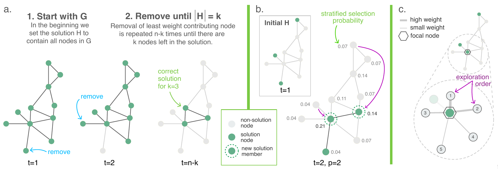

# OVNS: Opportunistic Variable Neighborhood Search



Welcome to the official GitHub repository of Opportunistic Variable Neighborhood Search (OVNS).
This repository contains the code base for the python implementation of the OVNS algorithm, a state-of-the-art (6/2023) performant heuristic for solving the *Heaviest k-Subgraph Problem* (HSP) in social networks. Among the key features of OVNS is its ability to employ stratified sampling to exploit heavy-tailed degree distributions typical to large social networks.

Note that in the literature HSP is also known under the names *k-cluster problem*, *maximum edge subgraph problem*, *maxsum problem*, *k-dispersion problem*, and *k-defence-sum problem*. OVNS can be used for solving special cases of HSP, including the *maximum diversity problem* (MDP) where edge weights are pairwise positive distances such as euclidean distances, and the *densest k-Subgraph problem* (DSP), which is the special case of HSP where all weights of the graph are either 0 or 1 (ie. unweighted network).

This repository includes implementations of reference algorithms BVNS [(Brimberg, 2009)](https://www.sciencedirect.com/science/article/pii/S0305054809000021) and OBMA [(Zhou et al. 2017)](https://ieeexplore.ieee.org/abstract/document/7864317/)

For more info, see our [research paper at arxiv](https://arxiv.org/abs/2305.19729).

## Authors
* Ville P. Saarinen
* Ted Hsuan Yun Chen
* Mikko Kivelä

## Table of Contents
- [Getting Started](#getting-started)
- [Prerequisites](#prerequisites)
- [Installation](#installation)
- [Usage](#usage)
- [Results and Benchmarks](#results-and-benchmarks)
- [Contributing](#contributing)
- [License](#license)
- [Contact](#contact)

## Getting Started

Implementation uses **numba** and numpy arrays for JIT compiling the code base. This offers up to 100x speed up compared to vanilla python.

### Prerequisites

This software has the following dependencies:

- Python (3.9 or newer)
- Numba (0.56 or newer)
- Numpy
- Matplotlib (optional, used for diagnostic plotting)

### Installation

1. Clone the repository:
    ```sh
    git clone https://github.com/decitizen/ovns.git
    ```

2. Install Python dependencies:
    ```sh
    pip install -r requirements.txt
    ```

## Usage

After installation, you can run the OVNS algorithm on your own social network data.

```python
# Import ovns package
from ovns import ovns
import numpy as np

N = 1000                               # Number of nodes in the network
rng = np.random.default_rng()
A = rng.standard_exponential((N, N))   # Random adjacency matrix carrying the weight information
k = 20                                 # Size of the targeted subgraph

result = ovns.OVNS(A, k)

```

Another example with 1 hour runtime budget and step size proportional to the size of target subgraph

```python
# Import ovns package
from ovns import ovns
import numpy as np

N = 10000
rng = np.random.default_rng()
A = rng.standard_exponential((N, N))
k = 400
timetol = 3600                         # Time budget in seconds
k_step = k // 10                       # Size by which the neighborhood change will be incremented

result = ovns.OVNS(A, k, k_step=k_step, timetol=timetol)

```

## Results and Benchmarks

We have conducted benchmarks in both real-life social networks as well as synthetic networks. Please see our paper https://arxiv.org/abs/2305.19729 for a comprehensive explanation and discussion of these results.

## Contributing

We welcome contributions to the OVNS project. Please read [CONTRIBUTING.md](CONTRIBUTING.md) for details on our code of conduct, and the process for submitting pull requests to us.

## License

This project is licensed under the MIT License - see the [LICENSE.md](LICENSE.md) file for details.

## Contact

If you have any questions or comments, please feel free to reach out to the authors @decitizen via email ville.saarinen@tuta.io

